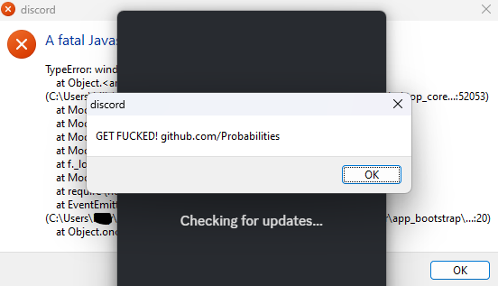

<div id="top"></div>

<div align="center">
  <a href="https://lunarservices.cc/shop">
    
  </a>
  
  <h2 align="center">Discord-Crash-Troll</h3>

  <p align="center">
     Discord crash troll that injects javascript code into all discord clients on the users system that will cause the client to crash upon start. Meaning the user will not be able to use discord clients unless the remove the injection. 
    <br />
    <br />
    <a href="https://lunarservices.cc/discord">Discord & Support Server</a>
    .
    <a href="https://lunarservices.cc/shop">Sellix Store</a>
  </p>
</div>

### More Information

- This is for educational purposes only
- Bored and decided to make this
- You need basic nodejs knowledge to use this. I will not teach you how to install nodejs etc.

### How to use
Install the packages
```
npm install
```

Command to run the injection
```
node inject.js
```

Command to revert the injection
```
node revert_injection.js
```

Pretty Simple :D


### PLEASE SHOW SOME ❤️ BY FOLLOWING AND LEAVING A STAR
